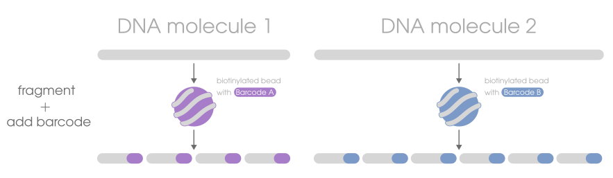

We call it BLink-seq and it's a genomic sample preparation method to create [linked-read](../../info/linkedreads) data.
The technology relies on biotinylated magnetic beads coated in combinatorial barcodes (BLink beads) as the substrate
on which to perform tagmentation (fragment + tag). The reaction first binds DNA to the beads, then
enzymes fragment the DNA and add a molecular barcode to the sheared DNA. Since each BLink-bead is covered in
a unique combinatorial barcode, all the DNA fragments produced from a single source molecule wrapped around
a bead will get the same barcode attached to it.

:::note[BLink is pronounced _blink_, like to blink an eye]
:::

## Why this matters
After the DNA gets sequenced, reads that have the same molecular barcode can be inferred as having originated
from the same source long DNA molecule. As a result, you can get short-read cost, throughput, and accuracy,
and with the kind of long-range information you would get from significantly costlier and less accurate long-read data.

:::tip
Another way of thinking about it is you're chemically subsampling what
would be a long-read molecule.
:::

## Applications
BLink-seq provides the same benefits as other linked-read technologies:
- improved genome assembly or scaffolding
- better metagenome assembly
- significantly improved direct haplotype phasing (vs regular short reads)
  - "direct" meaning you don't need parent-offspring trios
- structural variant detection
- barcode-aware alignment
  - tends to align better in repeat regions
