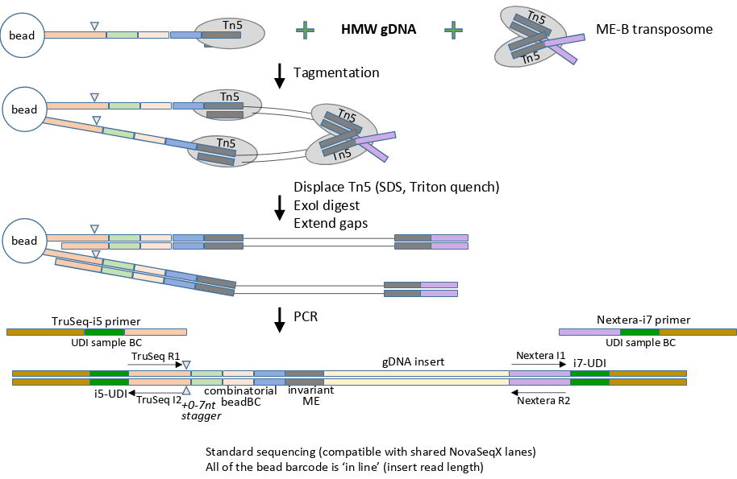

import { Badge } from '@astrojs/starlight/components';

BLink-seq libraries are characterized by having a three 12bp segments and 1 variable-length "stagger" that
comprise a combinatorial barcode. The segments each have a small spacer between them and the stagger serves
to balance fluorescence during sequencing, along with acting as the 4th segment in the barcode. Each of the
segments could be one of 96 unique barcodes, and the stagger can have a handful of length variants, resulting
in ~7 million possible unique barcodes.

The libraries are also flanked with Universal Dual Index sequences, which serves 3 functions:
1. provides a sample-level barcode in the index reads for demultiplexing
2. mitigates barcode-hopping on NovaSeq machines
3. makes them 100% compatible with standard sequencer runs, meaning no custom sequencer configurations or requests need to be made or known ahead of time

## Data Characteristics
### Read Length
The barcode and ME sequence are part of Read 1 (as opposed to the index sequence), meaning
after removing the technical sequences, Read 1 will be ~75bp. Since no analogous technical sequences
are added to Read 2, it retains its full length (typically 150bp).

### FASTQ format
BLink-seq traces its origins to haplotagging and uses the `ACBD` haplotagging barcode style so that
it can work seamlessly with existing linked-read software. BLink-seq data uses
the standard "LASTQ" format by default, meaning:
- the barcode is encoded in a `BX:Z` SAM tag in the sequence header comment
- it encodes read 1 and read 2 using the old CASAVA `/1` and `/2` format, respectively
  - this is so aligners can safely transfer the BX:Z tag comment without crashing
- it uses a `VX:i` tag to indicate if a barcode is valid or not
  - `VX:i:0` <Badge text="invalid" variant="danger" />
  - `VX:i:1` <Badge text="valid" variant="success" />
