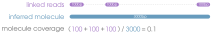
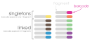
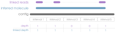

Unlike some other fancy well-touted sample preparation methods (_like mate-pair_), linked-read data **is** whole genome
sequencing (WGS). What that means is that whether you use the linked-read information or not, the data will always be standard and 
viable WGS compatible with whatever you would use WGS for. It's WGS, but with a little extra info that goes a long way.

## Linked-read library performance
Because linked-read data has an extra dimension, there are some additional metrics that are useful to look at to evaluate how "good" 
the linked-read library turned out. As a baseline for comparison, think of RAD or WGS data and the kinds of metrics you might look at 
for library performance:
- coverage depth
- coverage breadth
- PCR/optical duplicates
- coverage depth per sample

Linked-read library performance also looks at that, but there's a few extra parameters that help us assess performance:

### molecule coverage
Since linked reads are tagged per DNA molecule, we are interested in understanding coverage on a per-molecule basis. By "molecule",
we are referring to the original DNA molecule from which barcoded sequences originated from.

#### reads per molecule
It's quite rare that all fragments of a single DNA molecule will get sequenced, so we are interested in getting an average number of
reads (sequences) per original DNA molecule. This is done by getting counts of all the reads with the same barcode, as unique barcodes
correspond with unique DNA molecules. It's difficult to say exactly what a good number of reads per molecule would be, but >2 would be
a good starting point (1 would be a singleton, see below). Having 3-6 would be decent, depending on your project goals.

#### molecule coverage
Because only a few fragments from a DNA molecule end up getting sequenced, it is helpful to understand how much of a molecule is 
represented in seqences (breadth). It's impossible to get an accurate calculation for this metric because we have no way of knowing 
the size of the original DNA molecule, but we can find the distance between the two furthest reads 
sharing a barcode after alignment and calculate how many bases between them have been sequenced. It's not perfect, but it's something. A low number 
would indicate large gaps between linked sequences (e.g. few sequences and/or a very large molecule), whereas a high number would 
indicate small gaps between linked sequences (e.g. many sequences and/or a very small molecule).

### singletons
Because linked reads need to be, well, _linked_, we need to know exactly how many of the sequences actually share barcodes. A barcode 
that only appears in one paired or unpaired read is a **singleton**, meaning it isn't actually linked to any other sequence. Despite 
having a linked-read barcode, the absence of other reads with the same barcode means the barcode information for that read (or read 
pair) is mostly useless, aka it's just a plain-regular short read and can be used as such. Having <60% would be considered decent, 
but you would want as few singletons as possible in a linked-read dataset. For perspective, if 90% of your reads were singletons, you 
can think of that as "90% of your data aren't linked reads". The opposite of a singleton is when a barcode is shared by more than one
paired or unpaired read, aka a linked read.

## linked coverage
Because of the "linked" component of linked-read data, we have an additional kind of sequence coverage
to consider, which is **linked coverage**. Since linked-read barcodes preserve long-distance information, we can do an alternative kind of
coverage calculation where you pretend that all the sequences with a shared barcode are one big gapless sequence. If you use your 
imagination that way, the name "synthetic long reads" begins to make more sense. Mathematically, the linked coverage (breadth and 
depth) should always be higher than the coverage from just the alignments themselves, as gaps between linked reads are counted as 
well. If you see that your linked depth is unusually high (e.g. the aligmment depth is 20 and linked depth is >1000), then it's
very likely your have barcode clashing that has not been deconvoluted. In other words, reads from different DNA molecules that are
sharing a barcode are mapped very far from each other and inflating the depth values for everything in between.

