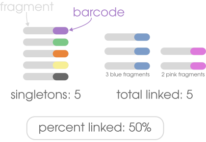
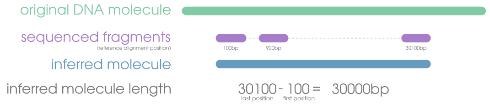
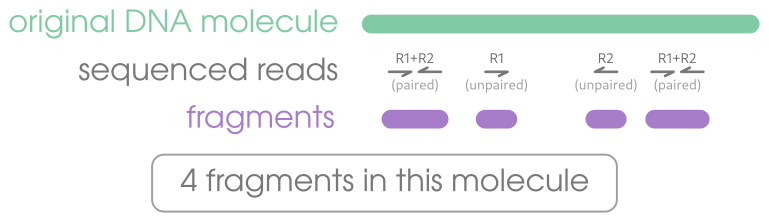

import { Badge } from '@astrojs/starlight/components';
import { Card } from '@astrojs/starlight/components';

All sequencing data needs to be evaluated for various performance metrics. These include things like:
- coverage depth
- coverage breadth
- PCR/optical duplicates
- coverage depth per sample

Since linked-reads have an extra dimension (their molecular barcodes), there are some additional metrics specific
to linked read data that are necessary for:
<Card title="1. Understanding your data">
  It's critical to understand the quality of your data coming off of a sequencer because it will help set
  expectations for downstream applications. Your scaffolding wasn't very effective? Maybe it's because there was
  very little linking.
</Card>

<Card title="2. Reporting in publications">
    This will help reviewers and readers understand your data too and contextualize your findings. It will also
    provide meaningful information for what they might expect if they make linked-read libraries. The metrics described
    below need to become standard reported metrics.
</Card>

The descriptions below use linked-read specific language. If you aren't familiar with concents like fragments or molecules,
please refer to [the guide on linked-read terminology](../terminology)

## linked
Having \>60% would be considered decent. You would want as few singletons (unlinked fragments) as possible in a linked-read dataset.
For perspective, if 10% of your fragments were linked, you can think of that as "90% of your data aren't linked reads".

## inferred molecule size
A molecule will almost never be sequenced in it's entirety, but we can try to estimate how long it was.
It's impossible to get an accurate calculation for this metric because we have no way of knowing 
where along the molecule our fragments came from, but we can find the distance between the two furthest reads 
sharing a barcode after alignment. If there are 7 fragments in a read cloud, we can infer that the souce molecule
was the distance between the maximal and minimal mapping positions of the fragments. It's not a perfect calculation,
but it's the best we can do with the data.

## fragments per molecule
Since all fragments of a single DNA molecule likely won't get sequenced, we are interested in getting an average number of
fragments per DNA molecule. This is done by getting counts of all the fragments with the same barcode, as unique barcodes
correspond with unique DNA molecules. It's difficult to say exactly what a good number of fragments per molecule would be,
but a minimum of 2 is necessary to be considered _linked_. Having 3-6 would be decent, depending on your project goals.

## molecule coverage
In addition to knowing the count of fragments representing a molecule, it is helpful to understand how many base pairs of
a molecule is represented in those seqences (breadth). A low number would indicate large gaps between linked fragments
(i.e., few fragments and/or a very large molecule), whereas a high number would indicate small gaps between linked fragments
(e.g., many sequences and/or a very small molecule).

## linked coverage
Because of the "linked" component of linked-read data, we have an additional kind of sequence coverage
to consider, which is **linked coverage**. Since linked-read barcodes preserve long-distance information, we can do
an alternative kind of coverage calculation using inferred molecules[^1] instead of sequences. Mathematically, the
linked coverage (breadth and depth) should always be higher than the coverage from just the alignments
themselves, as gaps between linked reads are considered "sequenced". If you see that your linked depth is unusually high (e.g., the
aligmment depth is 20 and linked depth is >1000), then it's very likely your have barcode clashing that has not been deconvoluted.
In other words, reads from different DNA molecules that are sharing a barcode are mapped very far from each other and inflating the
depth values for everything in between.

[^1]: by pretending that all the sequences with a shared barcode are one big gapless sequence
