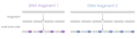
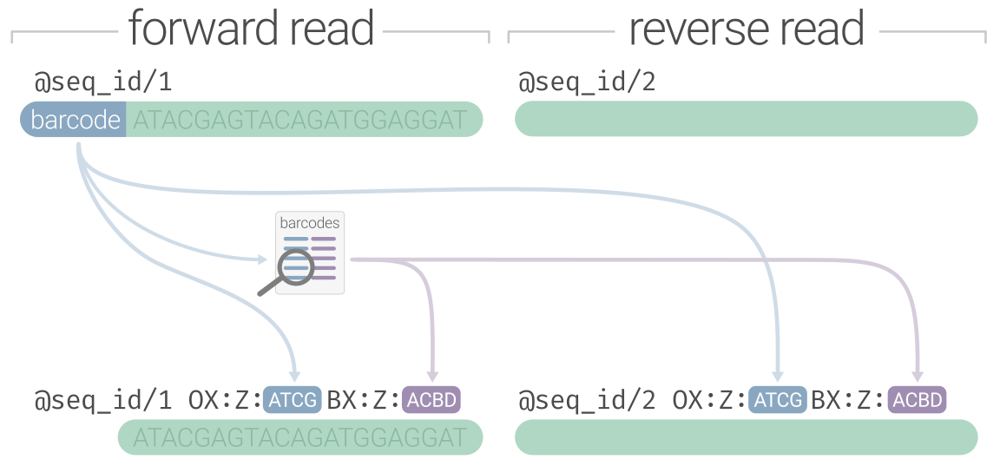

Linked reads are short read (e.g. Illumina) data. What makes them different is that they contain an added DNA segment ("barcode") that lets us associate
sequences as having originated from **a single DNA molecule**. That means if we have 4 sequences from a library that all contain the same added barcode,
then we infer that they must have originated from the same original DNA molecule. Different barcode = different molecule of origin.
If the sequences would map to the same genomic region during sequence alignment, we would know that those sequences with the same
barcode originated from **a single DNA fragment from a single homologous chromosome from a single cell**. That's right, **built-in phase information**.

## What linked reads look like
Linked-read data is sequence data as you would expect it, encoded in a FASTQ file. The first processing step of
linked-read data is demultiplexing to split the raw Illumina-generated batch FASTQ file into samples (if multisample)
and identify/validate the linked-read barcode on every sequence. For 10X data, the barcode would _stay_ inline with
the sequence (to make it LongRanger compatible), but for other varieties (haplotagging, stLFR, etc.) you would also
remove the barcode from the sequence and preserve it _somewhere_ in the read header. The demultiplexing process
is generally similar between non-10X linked-read technologies: a nucleotide barcode sequence gets identified and moved from
the sequence line to the read header with some kind of platform-specific notation. The diagram below preserves the nucleotide
barcode under the `OX:Z` tag and recodes it under `BX:Z` using the haplotagging "ACBD" segment format, however it would
also be valid to just keep the nucleotide barcode under `BX:Z`. Linked-read software is variable in its flexibility towards barcode 
formatting.

### Linked-read varieties
There are a handful of linked-read sample preparation methods, but that's largely an implementation detail. All of those methods are
laboratory procedures to take genomic DNA and do the necessary modifications to fragment long DNA molecules, tag the resulting fragments with the same
DNA barcode, then add the necessary Illumina adapters. It's not unlike the different RAD flavors (e.g. EZrad, ddRAD, 2B-rad)-- they all give you RAD data in the end,
but vary in how you get there in terms of cost and bench time. We obviously subscribe to BLink-seq 🤓.

It's worth describing the obvious differences of the raw (FASTQ) data. Knowing these details might help you 
make sense of compatibilties/incompatibilities for software, or how you can convert between styles. For more
information, [read this resource](https://pdimens.github.io/lastq/). **We strongly advocate for using Standard format**.

| Type                                                          | Location | Format   | Invalid Encoding | Example                            |
| :------------------------------------------------------------ | :---------------------------- | :------- | :------------------------------------ | :--------------------------------- |
| [Standard](https://blinkseq.github.io/lastq/)                  | `BX:Z` and `VX:i` tags        | any      | `VX:i:0`                              | `BX:Z:31_442_512 VX:i:1`           |
| [Haplotagging](https://blinkseq.github.io/lastq/haplotagging/) | `BX:Z` tag                    | `ACBD`   | `00` segment                          | `BX:Z:A04C54B96D11`                |
| [stLFR](https://blinkseq.github.io/lastq/stlfr/)               | end of sequence ID            | `#1_2_3` | `0` segment                           | `@A003432423434:1:324#12_432_1`    |
| [TELLseq](https://blinkseq.github.io/lastq/tellseq/)           | end of sequence ID            | `:ATCG`  | `N`                                   | `@A003432423434:1:324:TTACCACGAGG` |
| [10X](https://blinkseq.github.io/lastq/10x/)                   | R1 read                       | `ATCG`   | `N`                                   | `AGGTTGGGTAAGATA...`               |
