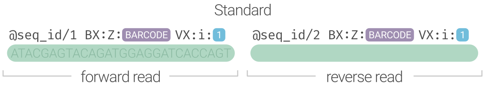

import { LinkButton } from '@astrojs/starlight/components';

The Standard (LASTQ) format guarantees `BX:Z` and `VX:i` SAM tags that encode the barcode and it's
validity. This format is universal and agnostic to all existing linked-read varieties and their particulars (including ours!).
It is 100% compliant with comment transfer during alignment and trivial to parse once in SAM format. We
created an entire website to promote this format across all linked-read technologies and build a unified
ecosystem for linked-read data.

<LinkButton href="https://blinkseq.github.io/lastq">The LASTQ Specification</LinkButton>

