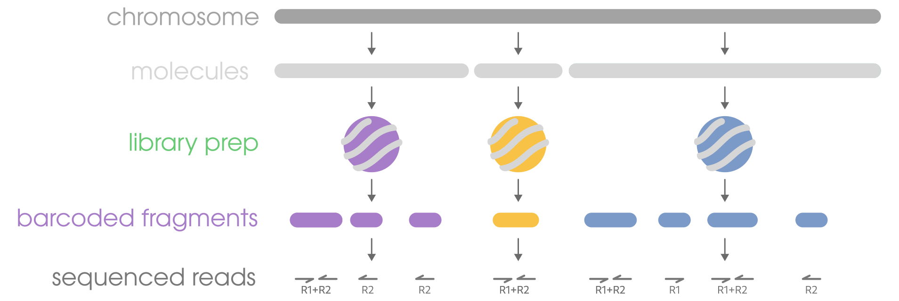
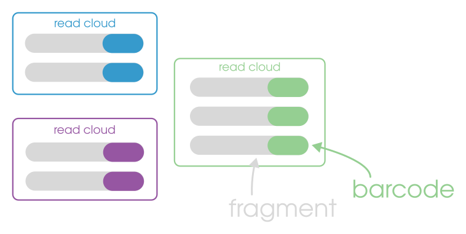

Linked-read data **is** whole genome sequencing (WGS). What that means is that whether you use the linked-read information
or not, the data will always be standard and viable WGS compatible with whatever you would use WGS for. It's WGS, but with
a little extra info that goes a long way. But, because linked-read data has an extra dimension (the molecular barcodes),
there are some additional concepts we need to consider that don't exist in regular WGS or long-read data.

### molecules
In the linked-read context, the phrase _molecule_ refers to a contiguous length of genomic DNA that went into library
preparation. Extracted DNA is usually fragmented in some way, be it enzymes or liquid handling, so we cannot expect
input DNA to be chromosome length.

### inferred molecules
While _molecules_ refer to the source DNA molecule, _inferred molecules_ refer to the maximum extent of a molecule
that we can infer from the sequencing data **after alignment**. If the original DNA molecule was 1Mb and our data included two [fragments](#fragments)
derived from it with the same barcode that were mapped 75kb apart, we can only infer the molecule to have been
75kb. Without mapping the reads, we cannot infer the sizes and positions of anything beyond the raw sequencing data.

### fragments
We typically think about sequencing data in terms of "reads" (e.g., a sequencer gives you 20 million reads for a sample), but
you will notice the term _fragment_ appearing in linked-read contexts, especially when using Harpy. The reason for this is
because reads are an inaccurate metric for understanding the efficacy of linked-read data. Read 1 and read 2 of a
read pair have the same barcode, so you could say that this barcode has 2 reads, and is thus linked. However, that would be
incorrect, because read 1 and read 2 are opposite ends from the same DNA _fragment_ and they don't tell use anything
about long-range information beyond what any standard paired-end read would. That is why we use the term _fragment_, which
instead rightfully tells us how many DNA fragments sharing the same barcode are representative of a single molecule. The
simple way to count these is:
| counts as 1 fragment | represented by |
|:--- |:---: |
| 1 read pair | R1 + R2 |
| 1 unpaired forward read | R1 only |
| 1 unpared reverse read | R2 only |

### read clouds
A read cloud is the collection of all of the sequences that have the same molecular barcode.
This phrase appears often in earlier linked-read literature, but is less common now.
Referring to something as a read cloud does not explicitly imply that the sequences have been
deconvoluted (see below). We are unaware of any existing language that makes such a disctinction.

### clashing / convolution
By the nature of linked read technologies, there will (almost always) be more DNA fragments than _unique_ barcodes for them. As a result,
it's common for barcodes to reappear in unrelated fragments. This is referred to as _clashing_ or _convolution_ and often needs to be 
dealt with so as to not incorrectly associate fragments with each other. The process of trying to correct convolution is referred to
as [deconvolution](../clashing).

### linked (vs singleton)
Because linked reads need to be, well, linked, we need to know exactly how many of the [fragments](#fragments) actually share barcodes. When a barcode is
represented by two or more fragments, we call that _linked_, and the opposite is when a barcode only appears in one fragment, which is called
a **singleton**. Since a singleton isn't actually linked to any other fragment, the barcode information for that read (or read 
pair) is mostly useless, aka it's just a plain-regular short read and can be used as such. 

