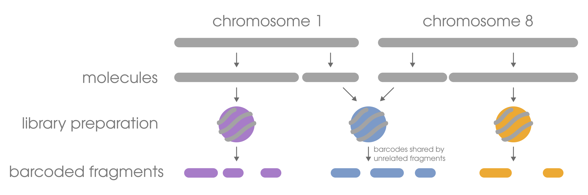
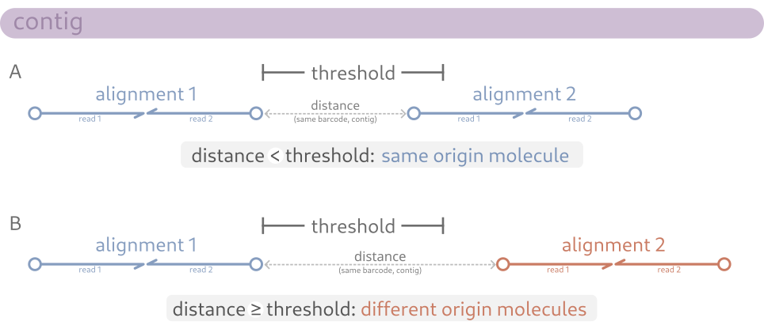

By the nature of linked read technologies, there will (almost always) be more DNA fragments than unique barcodes for them. As a result,
it's common for barcodes to reappear in unrelated fragments. This is referred to as _clashing_ or _convolution_ and often needs to be 
dealt with so as to not incorrectly associate fragments with each other.

There are approaches to overcome barcode clashing (_deconvolve_/_deconvolute_) in linked read data by determining which sequences
are sharing barcodes by chance rather than because they originated from the same DNA molecule. The likelihood of it happening is
usually low, but it's not impossible. When the algorithm determines that barcodes are being shared by unrelated molecules, the barcode typically
gets suffixed with a hyphenated number (e.g., `BX:Z:ATACG` becomes `BX:Z:ATACG-1`). As of this writing, there are only a few pieces of software
dedicated to deconvoluting linked-read data and do so with varying degrees of success and computational resource requirements. Similarly, linked-read
software is variable in its flexibility towards accepting the deconvolved-barcode format.

## Barcode thresholds
Rather than incorrectly assume that all sequences/alignments with the same barcode
originated from the same orignal DNA molecule, linked-read aware programs include a threshold parameter to determine a "cutoff" distance
between alignments with the same barcode. This parameter can be interpreted as "if a barcode appears more than `X` base pairs away from the
same barcode (on the same contig), then we'll consider them as originating from different molecules." If this threshold is lower, then
you are being more strict and indicating that alignments sharing barcodes must be closer together to be considered originating from the same
DNA molecule. Conversely, a higher threshold indicates you are being more lax and indicating barcodes can be further away from each other
and still be considered originating from the same DNA molecule. A threshold of 50kb-150kb is considered a decent balance, but you should choose
larger/smaller values if you have evidence to support them. 

| Alignment distance     | Inferred origin     |
| :--------------------- | :------------------ |
| less than threshold    | same molecule       |
| greater than threshold | different molecules |

:::caution[Potential SV detection obstruction]
This kind of deconvolving method relies on alignment distances, which may worsen
performance in finding structural variants larger than this threshold. For example,
two reads originating from the same DNA molecule may have aligned quite far from each other
due to mapping along the breakpoint of a very large inversion. If the inversion spans 3Mb,
a barcode threshold of 100kb will likely incorrectly deconvolve the two reads and assume
they shared a barcode by chance, which would hurt SV detection performance.
:::
