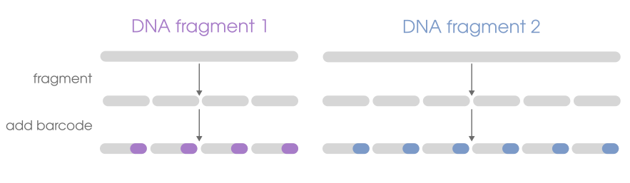
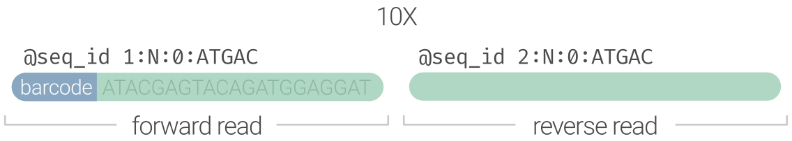
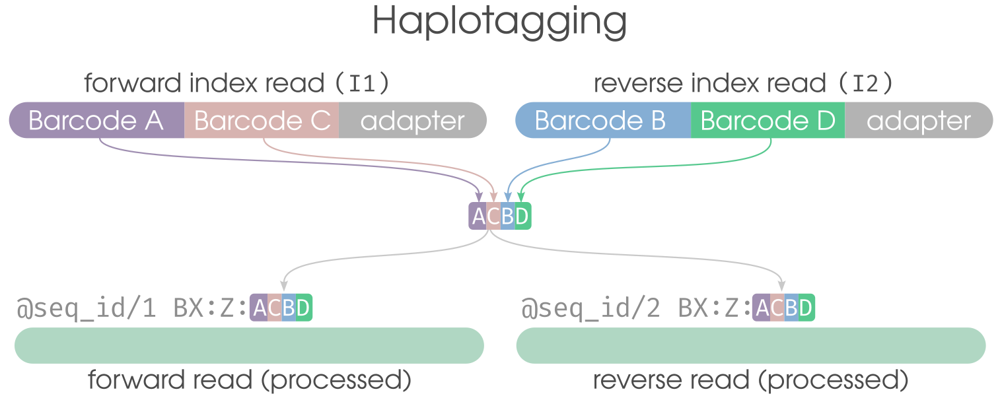
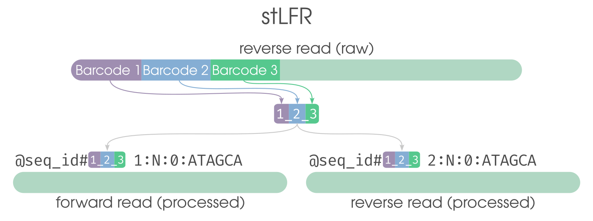
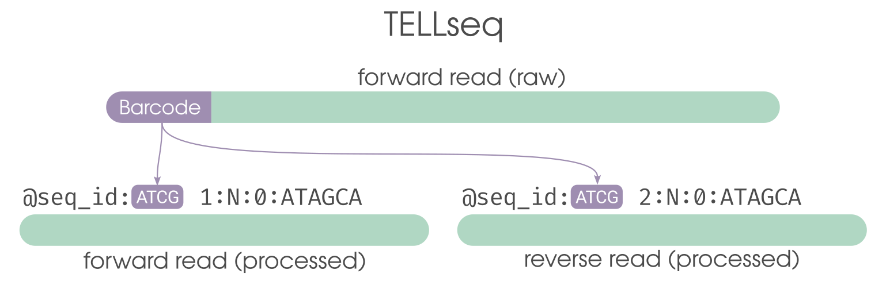

Linked reads are short read (e.g. Illumina) data. What makes them different is that they contain an added DNA segment ("barcode") that lets us associate
sequences as having originated from **a single DNA molecule**. That means if we have 4 sequences from a library that all contain the same added barcode,
then we infer that they must have originated from the same original DNA molecule. Different barcode = different molecule of origin.
If the sequences would map to the same genomic region during sequence alignment, we would know that those sequences with the same
barcode originated from **a single DNA fragment from a single homologous chromosome from a single cell**. That's right, **built-in phase information**.

## What linked reads look like
Linked-read data is sequence data as you would expect it, encoded in a FASTQ file. Different technologies put
the linked-read barcodes in different places, so the first processing step (after sample demultiplexing)
to identify/validate the linked-read barcode on every sequence, remove the barcode from the sequence,
and preserve it _somewhere_ in the read header. The result of that processing step is considered the final
appearance of linked-read sequence data, which varies somewhat between technologies. The diagram below preserves the nucleotide
barcode under the `OX:Z` tag and recodes it under `BX:Z` using the haplotagging "ACBD" segment format.

## Linked-read varieties
There are a handful of linked-read sample preparation methods, but that's largely an implementation detail. All of those methods are
laboratory procedures to take genomic DNA and do the necessary modifications to fragment long DNA molecules, tag the resulting fragments with the same
DNA barcode, then add the necessary Illumina adapters. It's not unlike the different RAD flavors (e.g. EZrad, ddRAD, 2B-rad)-- they all give you RAD data in the end,
but vary in how you get there in terms of cost and bench time. We obviously subscribe to BLink-seq 🤓.

It's worth describing the obvious differences of the raw (FASTQ) data. Knowing these details might help you 
make sense of compatibilties/incompatibilities for software, or how you can convert between styles.
**We strongly advocate for using Standard format**.

| Type                                                          | Location | Format   | Invalid Encoding | Example                            |
| :------------------------------------------------------------ | :---------------------------- | :------- | :------------------------------------ | :--------------------------------- |
| [10X](#10x-genomics)                   | R1 read                       | `ATCG`   | `N`                                   | `AGGTTGGGTAAGATA...`               |
| BLink-seq                  | `BX:Z` and `VX:i` tags        |  `ACBD`      | `VX:i:0`                              | `BX:Z:31_442_512 VX:i:1`           |
| [Haplotagging](#haplotagging) | `BX:Z` tag                    | `ACBD`   | `00` segment                          | `BX:Z:A04C54B96D11`                |
| [stLFR](#stlfr)               | end of sequence ID            | `#1_2_3` | `0` segment                           | `@A003432423434:1:324#12_432_1`    |
| [TELLseq](#tellseq)           | end of sequence ID            | `:ATCG`  | `N`                                   | `@A003432423434:1:324:TTACCACGAGG` |

---

### 10X Genomics
The elder of the bunch and also a discontinued commercial product. 10X-style FASTQ files have the linked-read barcode
as the first 16bp of the forward (`R1`) read. For these data to be compatible with the 10X LongRanger suite,
the barcode **must** stay in the read. Moving the first 16bp into the read header breaks LongRanger compatibility.

#### Specification

- barcode is the first 16bp of the `R1` read
- barcode stays in the sequence data for LongRanger compatibility
- limited to ~4.7 million barcodes
---

### Haplotagging
Unlike the other listed chemistries, [haplotagging](https://doi.org/10.1073/pnas.2015005118) is a non-commercial (DIY) linked-read chemistry. Haplotagging barcodes are combinatorial and
are made up of four 6bp segments. Two of these segments ("A" and "C") are the first 12bp of the `I1` read and
the other two ("B" and "D") are the first 12bp of the `I2` read, both of which are provided by Illumina for standard sequencing runs.
Because of this segment design, there are `96^4` (~84 million) possible barcode combinations (~900,000 per sample). 
The barcodes are stored in the sequence header under the `BX:Z` SAM tag, recoded in their "`ACBD`" format.

#### Specification
- 4 barcode segments
  - `A` segment is the first 6bp of the `I1` read
  - `C` segment is the next 6bp of the `I1` read (7-12)
  - `B` segment is the first 6bp of the `I2` read
  - `D` segment is the next 6bp of the `I2` read (7-12)
- barcode stored as `BX:Z` tag in the read header in `ACBD` format
  - e.g. `@A003432423434:1:324 BX:Z:A45C01B84D21`
- invalid barcode segment encoded with `00` (e.g., `C00`)

---
### stLFR
<strong>[Single-Tube Long Fragment Reads](https://doi.org/10.1101/gr.245126.118)</strong>

Another of the presently available commercial linked-read options. stLFR data uses combinatorial barcodes
made up for three 10bp segments which are at the end of the `R2` read. Demultiplexing these data results
in the barcode being moved to the sequence ID using a pound (`#`) sign between the sequence ID and barcode, with
the barcode recoded in the `1_2_3` format, where each segment is an integer.

#### Specification
- depending on the link sequence between segments, will be either the last 54bp or 42bp of the `R2` read
  - 54 base barcode: 10+6+10+18+10
  - 42 base barcode: 10+6+10+6+10
- barcode appended to sequence header with `#` sign
  - e.g. `@A003432423434:1:324#12_432_1`
- invalid barcode segment encoded as `0` (e.g., `1_0_29`)
- advertised to have a capacity over 3.6 **billion**, with up to 50 **million** per sample (actual results may vary)

---
#### TELL-seq
<strong>[Transposase Enzyme-Linked Long-read Sequencing](https://pmc.ncbi.nlm.nih.gov/articles/PMC7424984/)</strong>

One of the presently available commercial linked-read options. TELLseq data is very similar to 10X, except the
barcode is 18bp long and contained in the `I1` read that Illumina provides with the standard `R1` and `R2` reads. The
barcode gets appended in the read header using a colon (`:`).

#### Specification

- barcode is the first 18bp of the I1 read 
- barcode is appended to sequence header
  - e.g. `@A00234534562:1:544:AATTATACCACAGCGGTA`
- invalid barcode contains at least one `N` character
- advertised to have a capacity over 2 **billion** barcodes, but realistically use \<24 **million**
