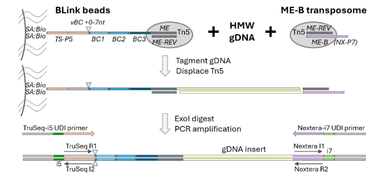

import { Steps } from '@astrojs/starlight/components';
import { LinkButton } from '@astrojs/starlight/components';
import { Aside } from '@astrojs/starlight/components';
import { Badge } from '@astrojs/starlight/components';
import { Card } from '@astrojs/starlight/components';

This page provides the BLink-seq library preparation protocol in full as a reference. The official PDF is better formatted for printing and
using in real time at a laboratory bench.

<h5 align="center">
<LinkButton href="https://github.com/BLinkseq/BLinkseq-Protocol/releases/download/1.0/BLink-seq_LibraryPrepProtocol.pdf" variant="secondary" icon="download">
    BLink-seq Library Protocol
</LinkButton>
</h5>

BLink-seq (bead-barcoded linked-read sequencing) technology generates an Illumina library of tagmented inserts that are
individually barcoded based on the molecule of origin. The combinatorial bead-barcode that is added to each sub-
fragment of the original HMW gDNA molecule can be used to infer phasing and linkage of sequenced fragments.
The method uses BLink beads: magnetic streptavidin dynabeads coupled to a 2x-biotinylated oligo containing a TruSeq-
P5 PCR handle, a variable-length barcode (vBC) to offset the start of the Illumina R1 read, a combinatorial barcode (3 x
12nt BC segments), and the Tn5 ME sequence. BLink beads are loaded with purified Tn5 protein to enable on-bead
tagmentation of HMW gDNA. A second Tn5 transposome in solution (ME-B) adds the Nextera-P7 PCR handle. PCR
with Illumina UDI primers (TruSeq-i5 and Nextera-i7) generates the final BLink-seq library.

The final insert size distribution is determined by the frequency of on-bead tagmentation (i5 end) and solution-phase
tagmentation (i7 end). Pilot experiments are recommended to optimize the insert size distribution to maximize the fraction
of the library within the 450-1200bp range. Adjusting both the amount of Tn5 used to load beads (Appendix D) and
especially the amount of solution-phase ME-B transposome is key to optimizing insert size. Once beads are saturated,
adding more Tn5 to beads typically does not alter the insert size, but adding more ME-B transposome during library prep
typically will decrease the insert size distribution. The amount of ME-B transposome required scales with gDNA input.
BLink libraries can be sequenced on Illumina instruments with standard sequencing primers and read lengths.

**Materials and Equipment Required**: See [Appendix A]()

**ME-B transposome**: To prepare ME-B transposome in solution, see [Appendix B]()

**BLink beads**: Can be stored in 3 formats:
1. fully loaded with active Tn5 transposomes, ready to use: follow protocol below
2. ME-REV hybridized, ready to load with Tn5: see Appendix D to prepare Tn5-loaded beads
3. Beads containing barcoded oligos, but requiring final stripping and ME-REV hybridization:
see Appendix C to strip/hybridize ME-REV, and then Appendix D to prepare Tn5-loaded beads

**Input genomic DNA**: High molecular weight (HMW) genomic DNA will generate BLink-seq libraries with more
linked reads and longer N50 values.
<Aside type="caution" title="DNA quality matters">
If genomic DNA is highly degraded, BLink-seq will offer little value over WGS.
</Aside>

## Experiment planning
<Card>
Typical tagmentation reaction components and volumes:
| per sample | Component                               | Notes                                          |
| ---------: | :-------------------------------------- | :--------------------------------------------- |
|      25 μl | 2x WASH+PEG buffer                      | final: 1x WASH, 0.1% Triton, 6.5% PEG6000      |
|       5 μl | Tn5-loaded BLink beads                  | see [Appendix C+D]() if needed                 |
|       5 μl | DNA                                     | 1.5ng total, dilute primary stocks to 0.3ng/ul |
|      14 μl | CS+DMF master mix                       | final: 1x CutSmart buffer, 10% DMF             |
|       1 μl | diluted (e.g. ~0.2μM) ME-B transposome* | See [Appendix B]() if needed                   |
|      50 μl | total volume in tagmentation reaction   |                                                |

*Once the appropriate amount of ME-B is optimized for a given batch of loaded beads + gDNA samples, ME-B
transposome can be added to the CS+DMF master mix for high throughput library prep, e.g. adding 15μl CS+DMF+ME-
B master mix per sample
</Card>

Volumes can be modified but the final concentrations of PEG, Triton, CutSmart buffer, and DMF should stay constant.
When increasing the amount of beads per reaction, adjustments to the WASH+PEG buffer concentration can be made. For
example, to use 50μL beads in a final 150ul tagmentation reaction volume, modify the plan to use a 3x formulation of
WASH+PEG buffer and scale up the amount of the CS+DMF master mix to maintain the final concentration per reaction.

The ratio of DNA:beads can change to meet project needs. A higher ratio of DNA to beads will lead to more barcode
[clashing](../../linkedreads/clashing) because multiple molecules may be tagmented on the same bead and have the same barcode.
Pilot experiments: vary the amount of ME-B transposome to optimize the amount needed for a good final library size
distribution. Typically the primary 2μM ME-B transposome stock is serially diluted in 50% glycerol storage buffer, such
that 1μl of different dilutions are tested in the pilot phase. **The optimal amount of ME-B transposome required is related to
the amount of DNA, not the volume of beads**; if the volume of beads is increased but DNA stays consistent, do not alter
the amount of ME-B transposome per reaction.

## Library Protocol
<Aside type="tip">
This protocol is designed for PCR strip tubes and reagent addition using multichannel pipettes or liquid handling
robotics (e.g. Mantis). Strip tubes with individually hinged caps are recommended instead of fixed plate format to
allow each strip to be mixed immediately and completely after each addition.
</Aside>
### 1. Prepare reagents
<Badge text="recommended" variant="success"/> use bench space and equipment that is dedicated to pre-amplification steps through **step 5**.
<Card title="1X WASH+T buffer">
Prepare fresh each day, store at room temperature

_5mL is sufficient for ~20 samples, scale up or prepare more as needed_

|Volume | Reagent |
|---: |:----|
|4.45 mL | Nuclease-free water |
|500 μL | 10x WASH buffer |
|50 μL | 10% Triton X-100 |
|5 mL  | Total volume |
</Card>
<Card title="2x WASH+PEG buffer">
Prepare fresh each day, store at room temperature.

Prepare excess buffer, e.g. 1.2 * N samples, this buffer is viscous and may need careful handling and optimization of settings on automated liquid handlers.

| Vol/sample | Reagent |
|---: |:----|
|13.0 μL | Nuclease-free water |
|5.0 μL | 10x WASH buffer |
|0.5 μL | 10% Triton X-100 |
|6.5 μL | 50% PEG8000 |
|25.0 μL | Total volume |
</Card>
    
<Card title="HMW sample gDNA">
Dilute to target concentration in 1x WASH+T buffer (e.g. 0.3ng/μl in min 5μl).

Rotate (or shake gently < 500RPM) at room temperature to mix well. Do not vortex vigorously to avoid shearing.

<Aside type="caution" title="Long-term storage">
While DNA samples can be diluted in advance, long-term storage of low concentration gDNA is not recommended
as DNA may adsorb to polypropylene. The Triton X-100 in the 1x WASH+T buffer may help block adsorbtion.
</Aside>
</Card>
  
### 2. Tagmentation reaction
<Steps>
  1. Preheat a Thermomixer with a 96well adapter to **55°C**
  2. Add **25μl WASH+PEG** per sample to labeled strip tubes
  3. Add **5μl Tn5-loaded BLink beads** to each tube
      - Note that beads are **not** washed before use, especially if ME-B duplex oligo is added when beads are loaded with Tn5 protein (see [Appendix C]()).
      <Aside type="tip" title="Master Mix">
      Optionally, instead of adding WASH+PEG and beads separately, prepare a master mix before aliquoting to tubes
      (e.g. 30μl total when using 5μl beads). This may lead to some bead loss because of the excess required to prepare
      in master mix format, so we recommend adding separately as indicated above if beads are limiting.
      </Aside>
  4. Close the strip and flick to mix well
      - The beads should be evenly dispersed before gDNA is added
  5. One strip at a time, add **5μl** diluted gDNA per sample. Immediately close the strip and flick/invert to mix well
      - Rapid and complete mixing is an important step for assay performance
      - <Badge text="recommended" variant="success"/> Use 1x WASH+T buffer as a no-DNA negative control
  6. Incubate minimum **10 min** on rotator at room temperature
      - This pre-incubation step allows DNA to potentially bind to beads before magnesium is added to activate Tn5
  7. Prepare CutSmart/DMF master mix at room temperature:
      <Card title="CutSmart/DMF Master Mix">
      | Vol/sample | Reagent | Notes |
      |----:|:----|:----|
      |4 μL | Nuclease-free water | |
      |5 μL | 10x rCutSmart buffer  | final 1x in tagmentation reaction = 10mM Mg++ |
      |5 μL | DMF | final 10% in tagmentation reaction |
      |1 μL | ME-B transposome (e.g. 1:10 dilution of 2μM stock) * | |
      |15 μL | Total | |
      
      *Before the optimal amount of ME-B is determined, do not include ME-B transposome in the master mix.

      Prepare excess master mix, e.g. 1.1 * N samples, or more if required for liquid handling dead volume
      
      For large master mixes, a primary stock of 2μM loaded ME-B can also be used; adjust the volume of water accordingly.
      </Card>
     8. Remove the strip-tubes from the rotator. If needed, very briefly pulse-spin the strip tubes to collect the volume at
     the bottom of the tube but try not to pellet the beads. Flick gently if the beads are not well dispersed.
     9. <Badge text="one strip at a time" variant="success"/> add **15μl CutSmart/DMF/ME-B Master Mix** per sample. Immediately close the strip and
     flick to mix well.
     10. <Badge text="alternative" variant="tip"/> If ME-B is added separately (e.g. pilot phase), first add **1μl diluted ME-B transposome** per sample and mix well. Then add **14μl CutSmart/DMF/ME-B Master Mix** per sample and immediately mix again.
       <Aside type="tip" title="Mix well">
           Rapid and complete mixing is an important step for assay performance. Addition of the CutSmart buffer containing
           magnesium will activate Tn5 transposition.
       </Aside>
     11. Incubate samples **30 min**, **500RPM** on a Thermomixer at **55°C**.
</Steps>

### 3. Quench Tagmentation Reaction
<Steps>
    12. Prepare 2% SDS
        - use a strip-tube reservoir, if needed; excess can be stored at room temperature
    13. When the tagmentation reaction is complete, immediately add **5μl 2% SDS** per sample (10% of the tagmentation
    reaction volume). Immediately close each strip after adding SDS and flick to mix well
    14. Incubate samples **7 min**, **500RPM** on a Thermomixer at **55°C**
    15. Prepare 10% Triton X-100
        - use a strip-tube reservoir, if needed; excess can be stored at room temperature
    16. When the SDS incubation is complete, add **5 μl 10% Triton X-100** per sample to quench SDS (equal volume to the amount of 2% SDS added above). Close each strip and flick to mix well.
    17. Pulse-spin each strip and place on a magnetic rack
</Steps>

### 4. ExoI treatment
This is to remove any untagmented oligos on the beads
<Steps>
    18. Prepare ExoI master mix on ice
        <Card title="ExoI Master Mix">
        | Vol/sample | Reagent |
        |---:|:---|
        | 17 μL | Nuclease-free water |
        | 2 μL | 10x rCutSmart buffer (NEB) |
        | 1 μL | Thermolabile ExoI (NEB) |
        | 20 μL | Total |

        Prepare excess master mix, e.g. 1.1 * N samples, or more if required for liquid handling dead volume
        </Card>

    19. Prepare a multichannel reservoir with 1xWASH+T buffer
    20. Remove the supernatant from the beads (on magnet) and discard. On magnet, add 100μl WASH+T
        - <Badge text="optional" variant="tip"/> If desired, beads can be ‘downsampled’ to generate a library for only a portion of the bead-bound
        tagmented fragments. Downsampling will generate a library with fewer fragments and lower complexity, but can
        increase the percent of linked reads at lower sequencing depths. The remaining tagmented beads can be stored
        at **4°C** and processed later if desired.
    21. To downsample beads: remove the strip from the magnet, flick or mix to disperse the beads, and transfer the desired portion to a new strip or tube and return to magnet. The equivalent downsampling can also be done at the wash step after ExoI treatment and before PCR.
    22. Remove the supernatant from the beads (on magnet) and discard
        - If processing many strips, either close them to prevent the beads from drying out while washing all of the strips, or add the ExoI master mix to each strip before continuing with the next strip.
    23. Remove the strip from the magnet and add **20 μl ExoI master mix** to each sample. Close the strip and flick to mix. Pulse-spin very briefly to ensure all of the liquid is at the bottom. The beads should remain fully dispersed.
    24. Incubate samples in a thermoscycler: **10min** at **37°C**, then **5min** at **65°C** (heat kill)
        - If possible, set the lid temperature to 65°C.
</Steps>
